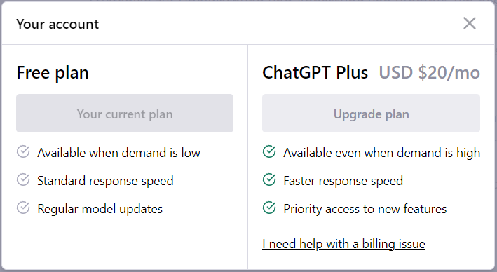
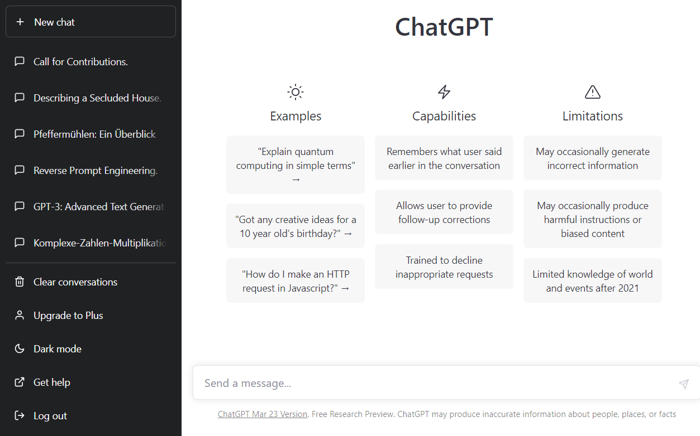

=== Chat-GPT Einführung

Chat-GPT ist ein Werkzeug, das in der Lage ist, im Dialog mit dem Nutzer
zu interagieren. Das GPT-Modell ist darauf trainiert den Anweisungen in
einer Eingabeaufforderung zu folgen, um im Rahmen eines Dialogs passende
Antworten zu geben. Chat-GPT kann bei der Beantwortung von Fragen
helfen, Rezepte vorschlagen, Texte in einem bestimmten Stil schreiben,
Code generieren und vieles mehr. Chat-GPT wurde auch darauf trainiert,
schädliche und unwahre Ausgaben zu vermeiden.

Chat-GPT kann unter https://chat.openai.com/chat kostenlos genutzt
werden. Lediglich eine Registrierung ist erforderlich. Es gibt auch eine
kostenpflichtige Version von Chat-GPT, die aktuell 20$ im Monat kostet
und dafür einige Vorteile bietet.

Die Oberfläche von Chat-GPT ist sehr einfach gestaltet.

Auf der Linken Seite gibt es oben einen „New chat“ Button, mit dem mein
eine neue Konversation anfangen kann. Darunter befindet sich die Liste
mit den bisher geführten Konversationen, die jederzeit aufgerufen und
weitergeführt werden können.

Das Haupt-Fenster befindet sich rechts. Hier wird später der Chatverlauf
angezeigt. Im unteren Teil befindet sich ein Eingabefeld in das die
Nachricht eingetragen werden kann. Es können auch mehrzeilige Eingaben
erfolgen. Ein Zeilenumbruch kann man mit der Tastenkombination
„[Shift][Enter]“ erzwingen.

Unten rechts sind noch ein paar Funktionen wie z.B. „Clear
conversations“, dass die Liste der Chats löscht, der „Upgrade to Plus“
Button mit dem man zu Chat-GPT Plus wechseln kann. Darunter gibt es die
Möglichkeit zwischen dem Dark Mode und dem Light Mode zu wechseln (Diese
Funktion bezieht sich ausschließlich auf die Darstellung. Die Antworten
von Chat-GPT ändern sich durch den Wechsel in den Dark-Mode nicht). Mit
dem „Get help“ Button kann man die Hilfe unter
https://help.openai.com/en/ aufrufen und mit dem „Log out“ Button
verlässt man Chat-GPT.