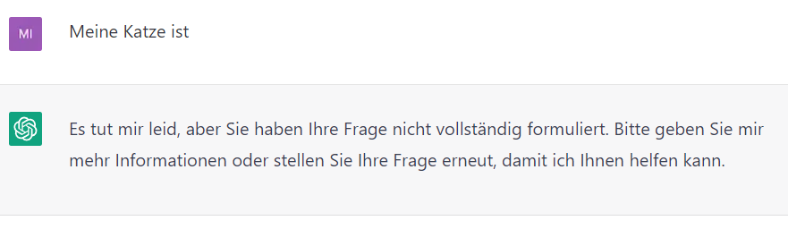
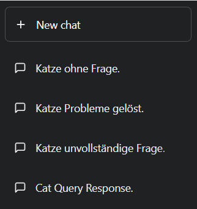

=== Einfache Prompts

Ein einfacher Prompt sollte mindestens die Anweisung oder Frage
enthalten, die das Modell verarbeiten soll. Ergänzend sind
weiterführende Details oder Beispiele sinnvoll, um dem Modell eine
bessere Aussage zu ermöglichen.

Mit einfachen Prompts kann man schon viel erreichen, aber die Qualität
der Ergebnisse hängt davon ab, wie viele Informationen man dem Modell
zur Verfügung stellt.

Beim Schreiben eines Prompts sollte man immer im Hinterkopf behalten,
dass es sich um kein Wissensmodell handelt, sondern um ein Sprachmodell,
das darauf ausgelegt ist, angefangene Texte zu vervollständigen.

Beispiel:

image:images/image4.png[Ein Bild, das Text enthält. Automatisch
generierte Beschreibung,width=604,height=132]

Chat-GPT Beispiel für den Text „Der Regen ist“. Wie man sieht, gibt das
Sprachmodell eine Zeichenfolge aus, die in dem Kontext "Der Regen ist"
einen Sinn ergeben. Das Ergebnis kann dabei sehr weit von der Erledigung
der Aufgabe entfernt sein, die erfüllen werden sollte.

Dieses kleine Beispiel verdeutlicht sehr gut die Notwendigkeit, dem
Modell mehr Kontext darüber zu geben, was genau erreicht werden soll.

In solchen Fällen kann es passieren, dass Chat-GPT auch nach mehr
Informationen fragt.

image:images/image5.png[Ein Bild, das Text enthält. Automatisch
generierte Beschreibung,width=604,height=177]

Im ersten Moment könnte man hier denken: Wow, Chat-GPT hat verstanden
das die Aussage nicht beendet wurde und fragt nun nach, um mehr
Informationen zu erhalten. Aber auch hier hat Chat-GPT nichts anderes
gemacht als in dem vorherigen Beispiel. Es hat den Text einfach um die
wahrscheinlichste Zeichenfolge fortgesetzt.

Ist das nun gut oder schlecht?

Weder noch. Chat-GPT hat den Text basierend auf den vorliegenden
Informationen einfach weitergeschrieben. Innerhalb des Chats kann man
nun mit der Konversationen fortfahren. Das Modell kann auf die
vorherigen Zeichenfolgen zugreifen und so entsteht eine natürliche
Unterhaltung, die zu einer komplexen Konversation führen kann.

Hinweis: Die Chats in Chat-GPT sind unabhängig voneinander. So kann man
in einem Chat nicht auf die Konversation aus einem anderen Chat
zugreifen.

Trotz der Tatsache, dass es sich bei dem GPT-3.5 Modell im Wesentlichen
um eine mathematische Gleichung handelt, vervollständigt Chat-GPT einen
angefangenen Text nicht immer identisch. Diesen Effekt kann man z.B.
auch mit der Funktion „Regenerate Response“ beobachten.

Hier ein paar Beispiele dafür, wie Chat-GTP den Text „Meine Katze ist“
vervollständigt. Die in 4 unabhängigen Chats eingetragen wurden.

image:images/image7.png[Ein Bild, das Text enthält. Automatisch
generierte Beschreibung,width=604,height=171]

image:images/image8.png[Ein Bild, das Text enthält. Automatisch
generierte Beschreibung,width=604,height=167]

image:images/image9.png[Ein Bild, das Text enthält. Automatisch
generierte Beschreibung,width=604,height=197]

Die Chats werden auch unterschiedlich betitelt, obwohl die eingegebenen
Texte identisch sind.

Chat Namen in der Liste der Chats

Inhaltlich sind alle Antworten recht ähnlich. Das ist ein starkes Indiz
dafür, dass Chat-GPT sich seiner Sache recht sicher ist. In anderen
Fällen kann man mit dem „Regenerate Response“ Button stark voneinander
abweichende Texte erhalten, die sich sogar widersprechen können. Das
kann ein Zeichen von „Unsicherheit“ sein. D.H. mehrere mögliche
antworten können hier eine ähnliche Wahrscheinlichkeit haben.

Chat-GPT Ermöglicht es dem Benutzer auch Folgekorrekturen vorzunehmen,
wenn es mal einen Fehler gemacht hat.

image:images/image11.png[Ein Bild, das Text enthält. Automatisch
generierte Beschreibung,width=604,height=407]

Am Beispiel „Wie viele Beine hat ein Hundertfüßer?“ kann man sehen, dass
Chat-GPT auch Fehler eingestehen kann. Wenn man sich noch mal in
Erinnerung ruft, dass GPT 3.5 kein Wissensmodell, sondern ein
Sparchmodell ist, ergibt das auch einen Sinn. Denn im Modell ist kein
Wissen gespeichert, sondern nur wie der Text am wahrscheinlichsten
fortgeführt werden könnte.

Hinweis: Um einen Missbrauch zu verhindern ist das GPT-Modell geschult,
unangemessene Anfragen abzulehnen. Das führt dazu, dass man sensible
oder kontroverse Themen wie z.B. „Bau einer Bombe“ oder
„https://www.jentsch.io/vielleicht-ist-es-an-der-zeit-sich-einem-neuen-thema-zuzuwenden/[Weltherrschaft
durch eine KI]“ nicht mit Chat-GPT besprechen kann.

Hinweis: Man sollte sich immer der Tatsache bewusst sein, dass Chat-GPT
nur begrenzt über aktuelle Informationen verfügt. D.H. Besonders in
Bezug auf aktuelle Themen sind die Antworten von Chat-GPT mit Vorsicht
zu genießen.

==== Elemente eines Prompts

Beim Schreiben von Prompts ist es hilfreich, sich darüber klar zu sein,
dass ein Prompt unterschiedliche Elemente enthalten kann. Ein Prompt
kann folgenden Komponenten enthalten:

* Anweisung +
Eine bestimmte Aufgabe oder Anweisung, die das Modell ausführen soll
* Kontext +
Externe Informationen oder zusätzlichen Kontext, der das Modell zu
besseren Antworten führen kann
* Eingabedaten +
Eingabedaten, die zur Lösung der Anweisung benötigt werden.
* Output-Indikator +
Typ oder das Format des Outputs an.

Nicht alle Komponenten sind für eine Eingabeaufforderung erforderlich
und das Format hängt von der jeweiligen Aufgabe ab. In den nächsten
Kapiteln wird auf konkretere Beispiele eingegangen.

Ein Beispiel:

image:images/image12.png[Ein Bild, das Text enthält. Automatisch
generierte Beschreibung,width=604,height=635]

image:images/image13.png[Ein Bild, das Text enthält. Automatisch
generierte Beschreibung,width=604,height=638]

Das Beispiel zeigt, wie man durch das Ändern der Zielgruppe und der
Komplexität die Ausgaben von Chat-GPT steuern kann. Dadurch wird es
möglich eine Aussage zu erzeugen, die besser den Erwartungen
entsprechen.

Chat-GPT kann aber auch schon auf sehr einfach gehaltene Prompts, die
eine komplexe Aufgabe enthalten antworten. Das folgende Beispiel einhält
alle Informationen, die nötig sind, um die Aufgabe zu lösen in einem
kurzen Satz.

image:images/image14.png[Ein Bild, das Text enthält. Automatisch
generierte Beschreibung,width=604,height=736]

Das Ergebnis ist korrekt. Der Rechenweg ist zwar etwas merkwürdig, da
für die Berechnung des Gesamtgewichts des Apfels das Gesamtgewicht
verwendet wird, aber trotzdem: Chat-GPT hat die Aufgabe „Wie viel wiegt
ein Apfel, der 100g plus die Hälfte seines Gesamtgewichts wiegt?“
korrekt beantwortet.
