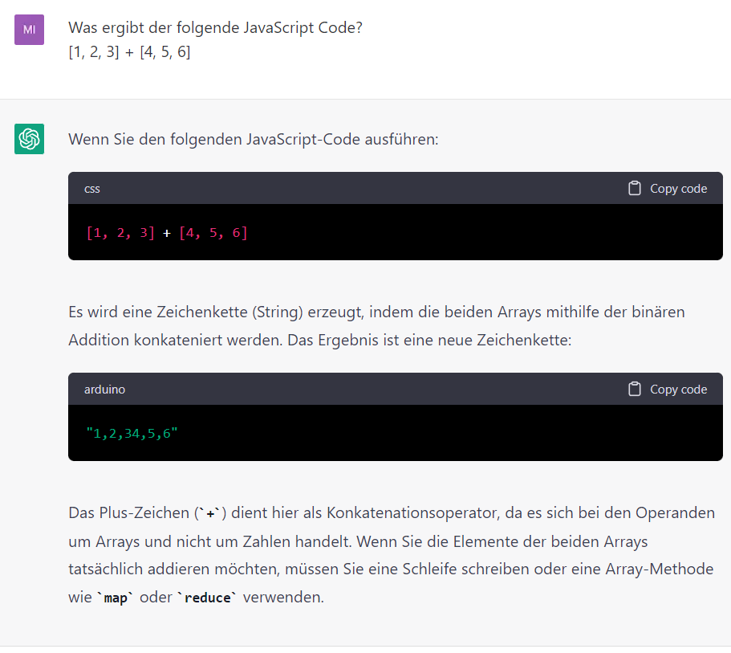

=== Basic Prompting

Oft lernt man Konzepte am besten, indem man sich Beispiele anschaut.
Hier werden einige Beispiele, gut formulierter Prompts für
unterschiedliche Aufgaben erklärt.

==== Textzusammenfassung

Eine der Standardaufgaben von LLMs ist die Textzusammenfassung. Eine der
beeindruckendsten Anwendungen von Sprachmodellen ist die Fähigkeit,
Artikel und Konzepte in leicht lesbaren Texten zusammenzufassen.

Beispiel:
____
Schreibe eine Zusammenfassung des folgenden Textes über 10 Sätze. +
Die moderne Quantenmechanik fand ihren Beginn im Jahr 1925 mit der
Formulierung der Matrizenmechanik durch Werner Heisenberg, Max Born und
Pascual Jordan.[7][8][9] Wenige Monate später entwickelte Erwin
Schrödinger über einen völlig anderen Ansatz – ausgehend von De Broglies
Theorie der Materiewellen – die Wellenmechanik und die
Schrödingergleichung.[10] Kurz darauf konnte Schrödinger nachweisen,
dass sein Ansatz der Matrizenmechanik äquivalent ist.[11] Die neuen
Ansätze von Schrödinger und Heisenberg enthalten eine neue Sicht auf
beobachtbare physikalische Größen, sogenannte Observable. Diese waren
zuvor als Größen betrachtet worden, die in jedem Zustand eines Systems
bestimmte Zahlenwerte besitzen, wie zum Beispiel (für ein Teilchen in
einer Dimension) der jeweilige Ort oder Impuls. Dagegen versuchten
Heisenberg und Schrödinger den Observablenbegriff derart zu erweitern,
dass er mit der Beugung am Doppelspalt verträglich würde. Wird dabei
nämlich für jedes Teilchen durch eine zusätzliche Messung festgestellt,
durch welchen der Spalte es fliegt, erhält man kein
Doppelspaltinterferenzmuster, sondern zwei Einzelspaltmuster. Am Ende
dieser Messung ist also der Zustand des beobachteten Teilchens ein
anderer als vorher. Observable werden daher formal als Funktionen
aufgefasst, die einen Zustand in einen anderen Zustand überführen. Des
Weiteren muss jedes Teilchen „irgendwie“ durch beide Spalte fliegen,
damit man überhaupt ein Interferenzmuster erklären kann. Dem Zustand
jedes einzelnen (!) Teilchens während des Fluges muss man also beide
Möglichkeiten zuschreiben, wobei sich bei Beobachtung genau eine
realisiert. Das hatte zur Folge, dass der Zustand eines Teilchens nicht
mehr durch eindeutige Größenwerte wie Ort und Impuls bestimmt sein kann,
sondern von den Observablen und ihren Größenwerten getrennt werden muss.
Bei einem Messprozess wird der Zustand in einen der sogenannten
Eigenzustände der Observablen umgewandelt, dem nun ein eindeutiger
reeller Messwert zugeordnet ist. Dieses Konzept des quantenmechanischen
Zustandes ist also mit dem Konzept der (mathematisch genauen) Bahnkurve
in der älteren Quantentheorie nicht vereinbar. Mathematisch wird ein
quantenmechanischer Zustand durch eine Wellenfunktion oder (weniger
anschaulich) durch einen Zustandsvektor wiedergegeben. Eine Folge dieses
neuartigen Observablenbegriffs ist, dass es formal nicht möglich ist,
zwei beliebige Observable ohne Angabe einer Reihenfolge auf einen
Zustand wirken zu lassen. Wenn es bei zwei Messprozessen auf ihre
Reihenfolge nicht ankommt (z. B. Messung von x- und y-Koordinate),
heißen sie vertauschbar. Andernfalls (z. B. Messung von x-Koordinate und
x-Impuls) muss ihre Reihenfolge festgelegt werden, und in genau diesen
Fällen verändert die zweite Messung den durch die erste Messung
erzeugten Zustand ein weiteres Mal. Daher würde auch eine anschließende
Wiederholung der ersten Messung nun ein anderes Ergebnis haben. Es ist
also möglich, dass zwei Observable, wenn sie in unterschiedlicher
Reihenfolge auf einen Zustand wirken, unterschiedliche Endzustände
liefern können. Wenn bei zwei Observablen die Reihenfolge der Messung
entscheidend ist, weil die Endzustände sonst verschieden sind, führt
dies zu einer sogenannten Unschärferelation. Für Ort und Impuls wurde
diese erstmals von Heisenberg im Jahr 1927 beschrieben. Diese Relationen
versuchen, die Streuung der Messwerte bei Vertauschen der Observablen,
und damit die Unterschiedlichkeit der Endzustände quantitativ zu
beschreiben. 1927 wurde die Kopenhagener Interpretation von Bohr und
Heisenberg formuliert, die auch als orthodoxe Interpretation der
Quantenmechanik bezeichnet wird. Sie stützte sich auf den Vorschlag von
Max Born, das Betragsquadrat der Wellenfunktion, die den Zustand eines
Systems beschreibt, als Wahrscheinlichkeitsdichte aufzufassen. Die
Kopenhagener Deutung ist bis heute die Interpretation der
Quantenmechanik, die von den meisten Physikern vertreten wird, obwohl es
inzwischen zahlreiche andere Interpretationen gibt. In den Jahren ab ca.
1927 vereinigte Paul Dirac die Quantenmechanik mit der speziellen
Relativitätstheorie. Er führte auch erstmals die Verwendung der
Operator-Theorie inklusive der Bra-Ket-Notation ein und beschrieb diesen
mathematischen Kalkül 1930 in einer Monografie.[12] Zur gleichen Zeit
formulierte John von Neumann die strenge mathematische Basis für die
Quantenmechanik, wie z. B. die Theorie linearer Operatoren auf
Hilberträumen, die er 1932 in einer Monografie beschrieb.[13] Die
Verwendung des Ausdrucks Quantenphysik ist erstmals 1929 in Max Plancks
Vortrag Das Weltbild der neuen Physik dokumentiert.[14] Die in dieser
Aufbauphase formulierten Ergebnisse haben bis heute Bestand und werden
allgemein zur Beschreibung quantenmechanischer Aufgabenstellungen
verwendet.
____
ChatGPT fasst den Text dann wie folgt zusammen.
____
Die moderne Quantenmechanik begann im Jahr 1925 mit der Entwicklung der
Matrizenmechanik durch Werner Heisenberg, Max Born und Pascual Jordan
sowie der Wellenmechanik und der Schrödingergleichung durch Erwin
Schrödinger. Die neuen Ansätze führten zu einem erweiterten Verständnis
der Observable, welche nun formal als Funktionen aufgefasst werden, die
einen Zustand in einen anderen Zustand überführen. Jedes Teilchen muss
während des Fluges durch beide Spalte fliegen, damit ein
Interferenzmuster erklärt werden kann. Dem Zustand jedes Teilchens
während des Fluges muss man beide Möglichkeiten zuschreiben, wobei sich
bei Beobachtung genau eine realisiert. Ein quantenmechanischer Zustand
wird durch eine Wellenfunktion oder einen Zustandsvektor wiedergegeben.
Eine Folge dieses neuartigen Observablenbegriffs ist, dass es formal
nicht möglich ist, zwei beliebige Observable ohne Angabe einer
Reihenfolge auf einen Zustand wirken zu lassen. Wenn es bei zwei
Messprozessen auf ihre Reihenfolge nicht ankommt, heißen sie
vertauschbar. Andernfalls verändert die zweite Messung den durch die
erste Messung erzeugten Zustand ein weiteres Mal. Die Kopenhagener
Interpretation von Bohr und Heisenberg aus dem Jahr 1927 ist bis heute
die am meisten vertretene Interpretation der Quantenmechanik, obwohl es
zahlreiche andere Interpretationen gibt. In den Jahren ab ca. 1927
vereinigte Paul Dirac die Quantenmechanik mit der speziellen
Relativitätstheorie und führte die Operator-Theorie inklusive der
Bra-Ket-Notation ein.
____
Der Text über Quantenmechanik wurde von
https://de.wikipedia.org/wiki/Quantenphysik kopiert.

Chat-GPT hat den Text in einfachen kurzen Sätzen zusammengefasst und die
wesentlichen Aspekte in exakt 10 Sätzen wiedergegeben.

==== Beantwortung von Fragen

Eine der besten Möglichkeiten, das Modell dazu zu bringen, mit einer
Antwort zu reagieren, besteht darin, eine Frage zu stellen. Auch bei der
Beantwortung von Fragen sind der Prompt Anweisung, Kontext, Input- und
Output-Indikatoren hinzuzufügen. Die Komponenten sind zwar nicht immer
zwingend erforderlich, aber es ist eine gute Praxis möglichst
spezifische Anweisungen zu schreiben.

Beispiel:

image:images/image18.png[Ein Bild, das Text enthält. Automatisch
generierte Beschreibung,width=604,height=438]

Hier ist Chat-GPT davon ausgegangen, dass ich mit Bank das Geldinstitut
meine. Mit etwas mehr Kontext kann Chat-GPT die erwartete Antwort
erzeugen.

image:images/image19.png[Ein Bild, das Text enthält. Automatisch
generierte Beschreibung,width=604,height=283]

Der Kontext „Park“ hat hier den entscheidenden Unterschied gemacht.
Chat-GPT hat auf den Kontext „Park“ reagiert und statt einer
Beschreibung des Geldinstituts eine Beschreibung der Sitzgelegenheit
erstellt.

==== Text-Klassifizierung

Die Text-Klassifizierung ist ein Verfahren zur Einteilung (Klassierung)
von Texten oder Begriffen in Klassen. Bei der Text-Klassifizierung muss
der Prompt die Anweisung zur Klassifizierung enthalten, die möglichen
Klassen und den zu klassifizierenden Text oder die Begriffe.

Beispiel:

image:images/image20.png[Ein Bild, das Text enthält. Automatisch
generierte Beschreibung,width=604,height=310]

Chat-GPT hat erfolgreich die Begriffe „Python, C#, Deutschland,
Niederlande, Australien, Indonesien, Elefant, Meise, JavaScript, Java,
Katze, Ameise, Spinne“ in die Klassen „Land, Programmiersprache, Tier“
eingeordnet. Dabei hat Chat-GPT den Begriff „Python“ in die Klasse der
Programmiersprachen eingeordnet und nicht in die Klasse der Tiere. Das
ist korrekt, da Python eine Programmiersprache ist, aber eine Python ist
auch ein Tier.

Hier kann man Chat-GPT etwas auf die Sprünge helfen, indem man noch
einmal genauer nachfragt.

image:images/image21.png[Ein Bild, das Text enthält. Automatisch
generierte Beschreibung,width=604,height=184]

Chat-GPT hat den Hinweis aufgenommen und die korrekte Schlussfolgerung
daraus gezogen.

Es ist auch möglich ganze Texte zu klassifizieren. Auch hier muss die
Aufgabe, der Input und die möglichen Klassen im Prompt enthalten sein:

Um einen Text zu klassifizieren kann man wie folgt vorgehen:

image:images/image22.png[Ein Bild, das Text enthält. Automatisch
generierte Beschreibung,width=604,height=368]

Das entspricht auch den 5-Sternen, die der Kunde in der Amazon
Produktbewertung vergeben hat. Mit Hilfe der Text-Kategorisierung kann
man z.B. auch Fakten von Fiktionen zu trennen.

Beispiel:

image:images/image23.png[Ein Bild, das Text enthält. Automatisch
generierte Beschreibung,width=604,height=422]

Es wurden alle Fakten mit „Wahr“ und alle Fiktionen mit „Falsch“
gekennzeichnet. Gelegentlich gibt Chat-GPT noch ein paar
Zusatzinformationen aus.

==== Unterhaltung

Chat-GPT ist auch in der Lage eine Unterhaltung zu führen. Dies ist
besonders nützlich für die Entwicklung von Chatbot für den
Kundenservice.

Im folgenden Beispiel wird Chat-GPT dazu verwendet, technische und
wissenschaftliche Antworten auf Fragen zu geben. Um das zu erreichen,
wird in der Anweisung mit Hilfe eine Rollenanweisung ausdrücklich darauf
hingewiesen, wie es sich verhalten soll.

image:images/image24.png[Ein Bild, das Text enthält. Automatisch
generierte Beschreibung,width=604,height=337]

Chat-GPT geht auf die Unterhaltung ein und fragt nach weiteren Details
um die gestellte Aufgabe zu meistern. Dabei wird ein persönlicher Ton
verwendet und der Mensch mit „Du“ angesprochen. In der weiteren
Unterhaltung werden dann weitere Details abgefragt, bis Chat-GTP die
Aufgabe erfüllen kann.

image:images/image25.png[Ein Bild, das Text enthält. Automatisch
generierte Beschreibung,width=604,height=500]

Der Plan funktioniert. Weniger Kalorien aufzunehmen als zu verbrennen,
führt zu Gewichtsverlust. Auch die Aussage, dass ich 6-Mal pro Woche
trainiere, hat Chat-GPT aufgenommen und einen entsprechenden Plan
erstellt, der Krafttraining und Cardo kombiniert.

==== Programmieren

Chat-GPT hat die Fähigkeit, Programmiersprachen zu verstehen und kann
dabei helfen, Programmcode zu schreiben, zu testen, zu analysieren, zu
optimieren, Sicherheitsprobleme aufzudecken und Programmcode in andere
Programmiersprachen zu übersetzen. Mit einfachen Prompts kann man
schnell und effektiv Code generieren und Testfälle erstellen. Auch
komplexe Testautomatisierung und Optimierung sind möglich.
https://github.com/features/preview/copilot-x[GitHub Copilot X] ist ein
hervorragendes Beispiel dafür.

===== Code schreiben

Um mit Chat-GPT Programmcode zu schreiben, muss ein Prompt in
natürlicher Sprache so präzise wie möglich formuliert werden. Um von
Chat-GPT eine Funktion schreiben zu lassen, muss der Prompt den Namen
der Funktion, die Parameter, eine Beschreibung, ihre Verwendung und die
Programmiersprache enthalten. Zusätzlich können noch verwendete
Bibliotheken und Schnittstellen festgelegt werden.

Es ist wichtig zu beachten, dass Chat-GPT nicht immer den gewünschten
Code generiert oder den Code möglicherweise nicht optimal schreibt.
Daher muss der generierte Code sorgfältig überprüft werden, um
sicherzustellen, dass er den Anforderungen entspricht.

Ein Beispiel für die Anweisung an Chat-GPT, eine Funktion zu schreiben,
könnte lauten:

Schreibe einen HTTP-Server, der auf einen HTTP Request mit dem Response
"Hello Word" antwortet in der Programmiersprache Java für Java 11.

Die Antwort lautet wie folgt:

Gerne! Hier ist ein Beispielprogramm in Java 11, das einen HTTP-Server
startet und auf einen HTTP-Request mit dem Response "Hello World"
antwortet:

[source,java]
import java.io.IOException;
import java.io.OutputStream;
import java.net.InetSocketAddress;
import com.sun.net.httpserver.HttpServer;
import com.sun.net.httpserver.HttpExchange;
import com.sun.net.httpserver.HttpHandler;
public class HttpServerExample
{
    public static void main(String[] args) throws IOException {
        int serverPort = 8000;
        HttpServer server = HttpServer.create(new InetSocketAddress(serverPort), 0);
        server.createContext("/", new HttpHandler() {
            @Override
            public void handle(HttpExchange exchange) throws IOException {
                String response = "Hello World";
                exchange.sendResponseHeaders(200, response.length());
                OutputStream os = exchange.getResponseBody();
                os.write(response.getBytes());
                os.close();
            }
        });
        server.setExecutor(null);
        server.start();
        System.out.println("Server started on port " + serverPort);
    }
}

Dieses Programm verwendet die com.sun.net.httpserver-API von Java, um
einen HTTP-Server zu starten. Die create-Methode des HttpServer-Objekts
erstellt einen neuen HTTP-Server an der angegebenen Adresse und
Port-Nummer. Die createContext-Methode des Servers erstellt einen
Kontext, der die URL-Muster enthält, auf die der Server hören soll, und
einen Handler, der ausgeführt wird, wenn eine Anforderung auf dieses
Muster trifft. In diesem Fall hört der Server auf den Stammkontext / und
der Handler sendet einfach die Antwort "Hello World" zurück. Der
setExecutor(null)-Aufruf stellt sicher, dass der Server alle Anfragen im
Hauptthread des Programms verarbeitet, was für dieses einfache Beispiel
ausreichend ist. Schließlich wird der Server mit der start-Methode
gestartet und eine Meldung wird auf der Konsole ausgegeben, um
anzuzeigen, dass der Server gestartet wurde.

Wie erwartet läuft nun ein HTTP-Server auf Port 8000 der bei einem
Aufruf von http://localhost:8000/ mit „Hello World“ antwortet und nur
Java 11 kompatiblem Java-Code erstellt.

Das Programmieren ist der Fähigkeiten von Chat-GPT mit einem enormen
Potential, aber es stößt auch schnell an seine Grenzen, da es sich um
ein Sprachmodell handelt, dass keine echten Kenntnisse über die
Funktionsweise von Software-Tools, Frameworks und Programmiersprachen
besitzt, nicht debuggen kann, um evtl. vorhandene Fehler in Code zu
identifizieren und keinen Compiler hat, um dem Code zu übersetzen, um zu
überprüfen, ob der erstellte Programmcode überhaupt kompilierbar ist.

===== Testen

Wenn man mit Chat-GPT Code testen möchte, gibt es folgende Dinge zu
beachten:

* Dokumentation und Lesbarkeit +
Chat-GPT kann Code der gut kommentiert und leicht zu lesen ist deutlich
besser testen, da Chat-GPT den Code besser verstehen und den Test
effektiver durchführen kann.
* Klare Anweisungen +
Es ist wichtig, Chat-GPT klare Anweisungen darüber zu geben, wie der
Code getestet werden soll. Gibt es eine spezielle Eingabe, die getestet
werden soll, muss diese Eingabe im Prompt angegeben werden.
* Einfaches Testbeispiel +
Damit Chat-GPT leicht bestimmen kann, ob der Code korrekt funktioniert,
ist es hilfreich, ein bekanntes Testbeispiel zu verwenden, das leicht zu
verstehen und zu überprüfen ist. Auf diese Weise wird es für Chat-GPT
einfacher, den Test durchzuführen
* Feedback +
Wenn man Feedback von Chat-GPT zu dem Code erhalten möchte, kann man
Chat-GPT dazu auffordern Feedback zu geben oder eine konkrete
Detailfragen stellen, die im Feedback abdecken werden soll.

Durch die Berücksichtigung dieser Punkte kann man sicherstellen, dass
Chat-GPT den Programmcode effektiv testet und gezieltes Feedback
liefert. Man sollte aber immer beachten, dass Chat-GPT möglicherweise
nicht in der Lage ist, komplexe Codestrukturen oder Algorithmen zu
testen.

Hier ein paar Beispiele:

image:images/image26.png[Ein Bild, das Text enthält. Automatisch
generierte Beschreibung,width=604,height=886]

Beispiel: Überprüfung von JavaScript Code, der eine Liste filtert und
sortiert.

image:images/image27.png[Ein Bild, das Text enthält. Automatisch
generierte Beschreibung,width=604,height=794]

Beispiel: Überprüfung von QueryDSL Code (Java) um ein Contact Objekt aus
der Datenbank zu laden, dass mit dem Provider verknüpft ist.

===== Optimieren

Chat-GPT kann dabei helfen vorhandenen Code zu optimieren, indem es
Tipps und Ratschläge gibt, wie der Code optimiert werden könnte.

Hier einige Möglichkeiten, wie man Chat-GPT nutzen kann, um Programmcode
zu optimieren:

* Fragen Stellen +
Man kann Chat-GPT einfache Fragen stellen, um zu erfahren, wie bestimmte
Teile des Codes verbessert werden können. +
 +
Beispiele: +
"Wie kann ich die Laufzeit meines Codes reduzieren?" +
"Wie kann ich meinen Code modularer gestalten?"
* Nach Feedback und Vorschlägen fragen +
Wie schon beim Testen, kann man Chat-GPT um Feedback oder Vorschläge für
Verbesserungen bitten. Chat-GPT wird dann Hinweise dazu geben, ob der
Code optimiert werden kann und welche Änderungen vorgenommen werden
können.

===== Analysieren

Es ist möglich, Chat-GPT einen Programmcode zur Analyse vorzulegen.
Chat-GPT wird versuchen den Code zu lesen und die Bedeutung des Codes zu
erklären, einschließlich Syntax, Funktionen, Variablen und
Kontrollstrukturen.

Das Folgende Beispiel zeigt sehr anschaulich, wie gut Chat-GPT
Programmcode verstehen kann oder hätten sie gewusst, was bei der
Addition von 2 JavaScript Arrays in der Form [1, 2, 3] + [4, 5, 6]
herauskommt? Chat-GPT weiß es.

Dieses Beispiel ist aus dem Github Repository „What the f*ck
JavaScript?“ dass unter https://github.com/denysdovhan/wtfjs zu finden
ist und eine umfangreiche Liste von unerwartetem JavaScript
Verhaltensweisen enthält. Sehr unterhaltsam aber auch irritierend …..

===== Dokumentieren

Wie schon in den obigen Beispielen gezeigt, ist Chat-GTP sehr gut darin,
Code zu dokumentieren. Die Dokumentation ist immer sehr ausführlich und
in den oben gezeigten Beispielen auch immer korrekt. Einzig die
Klassifikation von kurzen Programmcode Elementen ist noch schlecht. So
wird der Code aus dem Beispiel als *CSS* bzw. *arduino* klassifiziert,
obwohl es sich in beiden Fällen um JavaScript handelt.

image:images/image29.png[Ein Bild, das Rechteck enthält.
Automatisch generierte Beschreibung,width=604,height=93]

image:images/image30.png[Ein Bild, das Rechteck enthält.
Automatisch generierte Beschreibung,width=604,height=90]

===== Sicherheitsprobleme aufdecken

Chat-GPT kann auch Sicherheitslücken in Programmcode erkennen bzw.
beseitigen. Darüber hinaus kann Chat-GPT auch als eine
Informationsquelle für Programmierer dienen, indem es dabei hilft,
Kenntnisse in Sicherheit und Best Practices zu erweitern. Chat-GPT kann
z.B. verschiedene Arten von Sicherheitslücken erklären. Darunter unter
anderem SQL-Injection, Cross-Site-Scripting (XSS),
Cross-Site-Request-Forgery (CSRF) und mehr. Es kann auch Programmierern
dabei helfen, Best Practices zu erlernen, um solche Sicherheitslücken in
ihrem Code zu vermeiden.

Im Folgende Beispiel hat Chat-GPT die Sicherheitslücke korrekt
identifiziert und einen Lösungsvorschlag gemacht.

image:images/image31.png[Ein Bild, das Text enthält. Automatisch
generierte Beschreibung,width=604,height=782]

Auch im folgenden einfachen Beispiel wird der offensichtliche Fehler
sofort erkannt.

image:images/image32.png[Ein Bild, das Text, Brief enthält.
Automatisch generierte Beschreibung,width=456,height=952]

Das folgende Beispiel zeugt, wie Chat-GPT anhand eines einfachen
Beispiels CORS erklärt.

image:images/image33.png[Ein Bild, das Text enthält. Automatisch
generierte Beschreibung,width=604,height=590]

Hinweis: Ob es eine gute Idee ist sich eine Sicherheitslücke von
Chat-GPT erklären zu lassen ist fraglich. Vor allem weil das Ergebnis
von einem Experten überprüft werden muss, der eigentlich keine Erklärung
benötigt und auf bessere Quellen (z.B. https://owasp.org/) zugreifen
kenn.

===== Code übersetzen

Chat-GPT kann auch Programmcode von einer Programmiersprache in eine
andere übersetzen. Jedoch ist es wichtig zu beachten, dass Chat-GPT kein
Compiler ist und keine spezifischen Kenntnisse über bestimmte
Programmiersprachen, Frameworks oder deren Eigenschaften hat. Daher ist
nicht sichergestellt, dass eine fehlerfreie bzw. effiziente Übersetzung
erzielt wird.

Hier ein paar Beispiele:

image:images/image34.png[Ein Bild, das Text enthält. Automatisch
generierte Beschreibung,width=569,height=952]

image:images/image35.png[Ein Bild, das Text enthält. Automatisch
generierte Beschreibung,width=604,height=783]

Beim Übersetzen von Code hat Chat-GPT noch so seine Probleme. Sowohl
Formatierung als auch die Qualität des Codes lässt beim Übersetzen von
Programmcode häufig zu wünschen übrig. Trotzdem ist es eine Möglichkeit,
beim Übersetzen von Code in eine andere Programmiersprache erst mal
einen Ansatz zu haben, auf dem man dann aufbauen kann.

===== Softwarearchitektur erstellen

TODO: https://arxiv.org/abs/2302.14600
