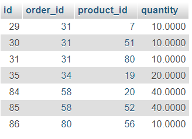

=== Fortgeschrittenes Prompting

Fortgeschrittenes Prompting zielt darauf ab, spezifischere bzw. genauere
Antworten zu aus dem Sprachmodell zu erzeugen. Fortgeschrittenes
Prompting ist ein leistungsfähiges Instrument zur Verbesserung der
Genauigkeit und Effizienz und zur Anpassung der Antworten an bestimmte
Aufgaben oder Anwendungen.

Einige potenzielle Vorteile von „Fortgeschrittenen Prompting“:

* Verbesserte Genauigkeit +
Durch spezifischere Anweisungen oder Kontext, kann das Modell genauere
und relevantere Antworten erzeugen.
* Anpassungsfähigkeit +
Feinabstimmung eines Sprachmodells, um Antworten zu generieren, die
einem bestimmten Stil oder Tonfall entsprechen, spezifisches Vokabular
und Wissen einbeziehen oder für einen bestimmten Themenbereich bzw.
Anwendungsfall relevant sind.
* Effizienz +
Reduktion der Iterationen, um eine korrekte Antwort zu generieren.

==== Zero-Shot Prompting

Ein Zero-Shot-Prompt ist ein einfacher Prompt, wie in den vorherigen
Kapiteln schon häufig gesehen. Der Begriff Zero-Shot-Prompting wird auch
oft verwendet, wenn im Prompt keine Beispiele angegeben werden. Ein
typisches Beispiel für einen Zero-Shot-Prompt bei einer
Frage-Antwort-Aufgabe wäre "Wer hat die Bibel geschrieben?“

image:images/image36.png[Ein Bild, das Text enthält. Automatisch
generierte Beschreibung,width=604,height=503]

In dem obigen Beispiel ist ein Zero-Shot-Prompt ausreichend, um die
Frage zu beantworten.

Wenn Zero-Shot nicht funktioniert, empfiehlt es sich, in der
Eingabeaufforderung Demonstrationen oder Beispiele zu geben, was zu Few
-Shot-Prompting führt.

==== Few-Shot Prompting

Few-Shot Prompting bezieht sich auf eine Technik, bei der im Prompt ein
oder mehrere (wenige) Beispiele angegeben werden, um eine bestimmte
Aufgabe zu erfüllen. Few-Shot-Prompts sind sehr effektiv, um eine
Aufgabe mit wenigen Eingaben zu erledigen da nur wenige Beispiele
benötigt werden, die leicht angepasst werden können.

Mit dem Few-Shot Prompting kann das Modell auf eine Aufgabe
feinabgestimmt werden, um die gewünschten Ergebnisse zu erzielen. Dies
ermöglicht es Prompt-Engineers, schneller und effizienter zu arbeiten,
da sie nicht jedes Mal von Grund auf eine neue Prompt-Strategie
entwickeln müssen.

Ein Prompt-Engineer kann Few-Shot Prompting nutzen, um eine neue Aufgabe
zu lösen, indem er nur wenige Beispiele oder eine kurze Anleitung als
Eingabe bereitstellt. Das Modell nutzt dann sein Verständnis der
Sprache, um die erforderlichen Informationen zu extrahieren und eine
Antwort oder Lösung zu generieren. Few-Shot Prompting ist eine
vielversprechende Technik, die das Potenzial hat, den Prozess der
Prompt-Erstellung signifikant zu beschleunigen und zu vereinfachen.

Few-Shot Prompting Beispiel:

____
Ein "Etwas" ist ein tragbares elektronisches Gerät, das es seinen
Benutzern ermöglicht, Anrufe zu tätigen und entgegenzunehmen,
Textnachrichten zu senden und zu empfangen, im Internet zu surfen, Musik
zu hören, Videos anzusehen und viele andere Funktionen auszuführen.

Dies ist ein Beispiel Satz, in dem das Wort "Etwas" verwendet wird.

Ich war in der S-Bahn unterwegs und alle Menschen um mich herum hatten
ihr "Etwas" in der Hand.

Ein "Salto" zu machen bedeutet, eine akrobatische Bewegung auszuführen,
bei der man sich in der Luft um die eigene Körperachse dreht und
anschließend wieder auf den Boden landet.

Ein Beispiel für einen Satz, in dem das Wort "Salto" verwendet wird,
ist:
____
image:images/image37.png[Ein Bild, das Text enthält. Automatisch
generierte Beschreibung,width=604,height=362]

Chat-GPT versucht nun einen Satz zu erstellen, der dem Satz „*Ich war in
der S-Bahn unterwegs und alle Menschen um mich herum hatten ihr ‚Etwas‘
in der Hand.*“ Entspricht und inhaltlich zum Salto passt. Anhand des
einen Beispiels könnte Chat-GPT nun einen ‚ähnlichen‘ Satz erstellen,
der Inhaltlich und thematisch von dem ursprünglichen Beispiel abweicht.
____
„*Die Turnerin führte einen perfekten Salto aus und erhielt dafür die
höchste Punktzahl.*“
____
Ein anderes Beispiel für Few-Shot Prompting ist:
____
Vervollständige den Satz "Zucker macht Menschen " in der Form wie die
folgenden Beispiele: Geld macht Menschen nicht glücklich. +
Wald macht Menschen gesund. +
Sport macht Menschen schlau.
____
image:images/image38.png[Ein Bild, das Text enthält. Automatisch
generierte Beschreibung,width=604,height=241]

In dem Beispiel enthält Chat-GPT 3 Beispiele, um das Modell auf die
Aufgabe vorzubereiten und die Aufgabe, den Satz „Zucker macht Menschen
…“, zu vervollständigen. Die Reihenfolge spielt hier keine große Rolle.
Chat-GPT erkennt die Aufgabe und übernimmt die Form aus den Beispielen.

Ob Zucker süchtig macht, ist umstritten und hier auch nicht relevant.

____
Zitat:
„Mit dem Begriff Sucht im Zusammenhang mit Nahrungsaufnahme sollte
vorsichtig umgegangen werden, da wir über diese Phänomene beim Essen
noch nicht genug wissen. Und Essen ist im Gegensatz zu Alkohol oder
Drogen für unser Überleben notwendig.“ +
https://www.ugb.de/ernaehrungsberatung/zuckersucht/
____

Mit dem „Regenerate Response“ Button kann man Chat-GPT um eine andere
Antwort bitten. Auf den obigen Prompt bekommt man von Chat-GPT noch
folgende andere Antworten.

* Zucker macht Menschen krank.
* Zucker macht Menschen dick und kann ihre Gesundheit beeinträchtigen.

Mit Hilfe von Few-Shot Prompting kann man das Verhalten der KI sehr
stark beeinflussen. Folgendes Beispiel zeigt, das anhand einer
Math-Aufgabe, die Chat-GPT ohne die 3 Beispiele ganz anders gelöst hat.

Prompt ohne Beispiele:

image:images/image39.png[Ein Bild, das Text enthält. Automatisch
generierte Beschreibung,width=604,height=142]

Ganz klar. 8 + 8 ist 16. Chat-GPT hat die Aufgabe wie erwartet gelöst.

Nun noch einmal die gleiche Aufgabe mit ein paar Beispielen, anhand derer Chat-GPT eine andere Berechnung des Ergebnisses veranlassen sollte.

image:images/image40.png[Ein Bild, das Text enthält. Automatisch
generierte Beschreibung,width=604,height=416]

Chat-GPT hat die 3 Beispiele analysiert, das Muster darin erkannt und
die Lösung „8 + 8 = 18“ gefunden. So kann mit Hilfe von Beispielen das
Verhalten der KI an die gestellt Aufgabe angepasst werden. Das ist sehr
hilfreich, wenn der Kontext nicht offensichtlich ist und es einfacher
ist ein paar Beispiele zu geben als den Kontext aufwändig zu erklären.

Es ist auch möglich, Chat-GPT einen Few-Shot-Input zu geben, da Chat-GPT
den Hinweis „Few-Shot-Input“ versteht und die Eingaben entsprechend
verarbeiten kann.

Hier ein Beispiel:

Prompt: +
____
Schreibe eine kurze Geschichte über eine Person, die unerwartet
Superkräfte bekommt.

*Few-shot Input:* Der Name der Person ist Alex und er ist ein
durchschnittlicher Büroangestellter. Eines Tages, als er auf dem Heimweg
von der Arbeit ist, wird er von einem Meteoriten getroffen.
____
Ausgabe:
____
Alex war ein durchschnittlicher Büroangestellter, der Tag für Tag seine
Routine im Büro absolvierte. Eines Tages war er auf dem Heimweg von der
Arbeit, als er einen seltsamen leuchtenden Gegenstand am Himmel sah. Es
war ein Meteorit! Bevor er reagieren konnte, wurde er von dem Meteorit
getroffen und fiel zu Boden.

Als er aufwachte, bemerkte er, dass sich etwas verändert hatte. Er
fühlte sich stärker und schneller als je zuvor. Er konnte plötzlich
enorme Gewichte heben und unglaublich schnell laufen. Verwirrt und
verängstigt von seiner neuen Stärke, beschloss Alex, seine Fähigkeiten
zu testen.

Er sprintete durch die Straßen seiner Stadt und sprang mühelos über
Gebäude. Er konnte durch Wände brechen und seine Hände in Flammen
setzen. Alex hatte Superkräfte!

Am Anfang war er überwältigt von seiner neuen Kraft und hatte Angst, was
die Menschen in seiner Umgebung denken würden. Aber dann erkannte er,
dass er seine Fähigkeiten für das Gute einsetzen konnte. Er beschloss,
seine Stadt vor Kriminalität und Unheil zu schützen.

Mit seinen neuen Kräften verhinderte Alex Raubüberfälle und half
Menschen in Not. Er wurde schnell zu einem Helden in seiner Stadt und
genoss das Gefühl, anderen helfen zu können. Alex hatte endlich einen
Sinn in seinem Leben gefunden.

In den folgenden Wochen und Monaten entwickelte Alex seine Fähigkeiten
weiter und erkannte, dass er noch viel mehr erreichen konnte. Er
entschied sich, seine Kräfte zu nutzen, um gegen das Böse in der Welt
anzukämpfen.

Und so wurde Alex zu einem der mächtigsten Superhelden der Welt. Aber er
erinnerte sich immer daran, dass seine Kräfte ihm gegeben wurden, um
anderen zu helfen und die Welt zu einem besseren Ort zu machen.
____

Mit diesem Few-Shot-Input wurde das Modell für die Aufgabe
feinabgestimmt und der Geschichte eine bestimmte Richtung gegeben.

Few-Shot-Prompting kann auch gut für Programmieraufgaben genutzt werden.
Z.B. um ein SQL-Statement zu erstellen, das Daten aus einer
(unbekannten) Datenstruktur selektiert. In den Few-Shot Inputs kann man
die nötigen Tabellen anreißen und dann eine konkrete Frage zu den
benötigten Daten stellen.

Beispiel Prompt:
[source,sql]
Q: Selektiere alle Produkte
A: SELECT id, product_code, product_name, description, list_price FROM
`products`;
###
Q: Selektiere alle Kunden
A: SELECT id, company, last_name, first_name, email_address, address,
city, state_province, zip_postal_code FROM `customers`;
###
Q: Selektiere alle Aufträge
A: SELECT id, customer_id, order_date, ship_address, ship_city,
ship_zip_postal_code, ship_country_region FROM `orders`;
###
Q: Selektiere alle Auftragspositionen
A: SELECT id, order_id, product_id, quantity FROM `order_details`;
###
Q: Selektiere die Auftragspositionen aller Kunden der Company "Company
D"
A:

Antwort:
[source,sql]
SELECT od.id, od.order_id, od.product_id, od.quantity +
FROM order_details AS od +
JOIN orders AS o ON od.order_id = o.id +
JOIN customers AS c ON o.customer_id = c.id +
WHERE c.company = 'Company D';

Chat-GPT hat hier die gewünschten Spalten der Auftragspositionen
selektiert, die beiden JOINs identifiziert um von der Tabelle *Customer*
über *Orders* auf *Order_Details* zu kommen und den Namen der Company in
die WHERE Klausel übernommen. Das Ergebnis entspricht dem erwarteten
Ergebnis.

Insgesamt scheint es, dass die Bereitstellung von Beispielen für die
Lösung einiger Aufgaben nützlich ist und Chat-GPT aus den Beispielen ein
Muster ableiten kann, mit deren Hilfe dann eine Lösung gefunden werden
kann.

Hinweis: Dieser Prompt kann auch schon in die Kategorie
„Chain-of-Thought“ fallen. Die Grenzen sind fließend und es gibt keine
klare Abgrenzung.

===== Grenzen des Few-Shot Prompting

Few-Shot Prompting funktioniert bei vielen Aufgaben gut, ist aber
dennoch keine perfekte Technik, insbesondere wenn es um komplexere
Denkaufgaben geht. Wenn Zero-Shot Prompting und Few-Shot Prompting nicht
ausreichen, könnte es bedeuten, dass das Modell nicht genug Daten hat,
um die Aufgabe korrekt zu lösen. Bei komplexen Zusammenhängen scheint es
so, als ob die Aufforderung mit wenigen Worten nicht ausreichend sind,
um zuverlässige Antworten zu erhalten. In dem Fall sollte man den Prompt
einer näheren Betrachtung unterziehen und überarbeiten.

Mögliche Verbesserungen eines Few-Shot Prompts:

* Weitere Shots ergänzen
* Problem in einzelne Schritte zerlegen.

An dieser Stelle ist es ratsam, über die Feinabstimmung des Modells
nachzudenken oder mit fortgeschritteneren Prompting-Techniken zu
experimentieren.

==== Chain-of-Thought (Gedankenkette) Prompting

Das Chain-of-Thought-Prompting wurde erstmals vom Google Research, Brain
Team im Januar 2022 in dem Paper
https://arxiv.org/abs/2201.11903[Chain-of-Thought Prompting Elicits
Reasoning in Large Language Models] vorgestellt und liegt aktuell in
der Version 6 (10 Jan. 2023) vor.

Die Experimente in dem vorliegenden Paper zeigen, dass die Aufforderung,
eine Gedankenkette aufzubauen, die Leistung bei verschiedenen
arithmetischen Aufgaben, Aufgaben des gesunden Menschenverstands und
Aufgaben des symbolischen Denkens wesentlich verbessern kann.

Es geht darum, beim Lösen einer Denkaufgaben den eigenen Denkprozess zu
berücksichtigen. Löst man z. B. ein mehrstufiges mathematischen Problem,
ist typisch, das Problem in Zwischenschritte zu zerlegen und jeden
Schritt zu lösen bevor man die endgültige Antwort gibt. Diese
Gedankenkette kommt oft bei Logik-Rätseln zum Einsatz. Hier ein paar
Beispiele.

Beispiel 1:

image:images/image42.png[Ein Bild, das Text enthält. Automatisch
generierte Beschreibung,width=604,height=410]

Beispiel 2:

image:images/image43.png[Ein Bild, das Text enthält. Automatisch
generierte Beschreibung,width=604,height=612]

In den Beispielen wird mit Hilfe einer Gedankenkette ein Lösungsweg
vorgegeben. Dieser kann von Chat-GPT analysiert werden. Mit Hilfe des
Lösungswegs kann dann die Lösung ermittelt werden.

Die Chain-of-Thought Prompting Methode hat in dem Paper
https://arxiv.org/abs/2201.11903[Chain-of-Thought Prompting Elicits
Reasoning in Large Language Models] besonders gute Ergebnisse bei
qualitativ hochwertigen, sprachlich vielfältige Mathe-Wortaufgaben für
die Grundschule funktioniert. Bei den Performance Tests konnte die
Lösungsquote bei Verwendung der
https://paperswithcode.com/dataset/gsm8k[GSM8K] ca. Datensatzes
verdoppelt werden. Andere Datensätze
(https://paperswithcode.com/dataset/svamp[SVAMP],
https://paperswithcode.com/dataset/mawps[MAWPS]) haben im GPT-3 Modell
keine so deutlichen Unterschiede gezeigt. Aber auch anderen Datensätze
wie
https://github.com/google/BIG-bench/tree/main/bigbench/benchmark_tasks/sports_understanding[Sport]
oder https://say-can.github.io/[SayCan] haben deutliche Verbesserungen
mit der CoT Prompting Technik erzielt.

==== Zero-Shot CoT

Eine Variante des Chain-of-Thought Prompts ist der Zero-Shot CoT die im
Wesentlichen darin besteht, der ursprünglichen Aufforderung den Text
"*Lass uns Schritt für Schritt denken*" hinzuzufügen. Diese Technik wurde unter https://arxiv.org/abs/2205.11916#["Large Language Models are Zero-Shot Reasoners"] erstmals vorgestellt.

Führt man das Beispiel zum Erzeugen eines SQL Statements (Siehe
„Few-Shot-Prompting“) mit der Ergänzung „*Lass uns Schritt für Schritt
denken“* aus, werden die einzelnen Schritte Lösungsschritte kurz
beschrieben und statt einem JOIN Statement wird ein SQL Statement aus
Subqueries gebildet.

image:images/image44.png[Ein Bild, das Text enthält. Automatisch
generierte Beschreibung,width=604,height=690]

Das Ergebnis der Abfrage ist wieder korrekt:

image:images/image45.png[Ein Bild, das Tisch enthält. Automatisch
generierte Beschreibung,width=322,height=275]

==== Self-Consistency

TODO https://openreview.net/forum?id=1PL1NIMMrw

==== Generated Knowledge Prompting

TODO https://arxiv.org/abs/2110.08387

==== Automatic Prompt Engineer

TODO https://github.com/keirp/automatic_prompt_engineer